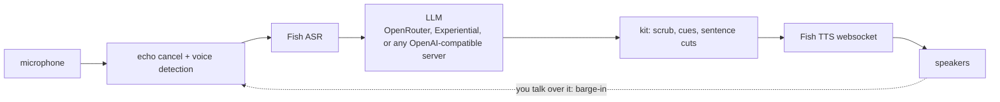

<div align="center">

<h1>fish-audio-suite</h1>

An opinionated Python toolkit for Fish Audio TTS, ASR, and live speech.

<p>
    <a href="https://github.com/kzndotsh/fish-audio-suite/actions/workflows/ci.yml">
        </a>
    <a href="https://www.python.org/downloads/">
        </a>
    <a href="https://docs.astral.sh/uv/">
        </a>
    <a href="LICENSE">
        </a>
</p>

</div>

> [!NOTE]
> Unofficial. Not affiliated with, endorsed by, or a product of Fish Audio.

> [!WARNING]
> Pre-1.0 and under active development. Anything could change at any moment and nothing is guaranteed. This notice will be left here until a stable release is published.

```text
you ▸  Hey, can you hear me?
llm ▸  [happy] Yes, I can hear you! [curious] What's on your mind today?
  ↳ first audio 1.99s · asr 0.30s · llm first token 0.75s · tts first audio 1.69s · total 5.57s
```
<sub>One turn of `fish-voice`, copied from a real run. Your numbers depend on your network, model and Fish latency setting.</sub>

---

## What is in the box

| Package | What it is | Reach for it when |
| --- | --- | --- |
| [`kit`](packages/kit/README.md) | Pure text. Cue tags, markdown and thought scrubbing, sentence cuts, caption files, the Fish error types. No network, no audio, no dependencies. | You build your own Fish client and want the text handling right. |
| [`proxy`](packages/proxy/README.md) | An OpenAI-compatible speech and transcription server in front of Fish, on `127.0.0.1:8849`. | Open WebUI, or any app that already speaks the OpenAI audio API. |
| [`voice`](packages/voice/README.md) | One Fish websocket per turn, playback sinks, and `fish-voice`, a full duplex voice chat in your terminal. | You want to talk to a model, or play one Fish turn from Python. |

`proxy` and `voice` both build on `kit`, and `kit` builds on nothing.

## The voice loop



With `FISH_VOICE_STREAM_TTS=1` the first sentence goes to Fish as soon as it is complete, so you hear it while the model is still writing. The flush waits for the end of the sentence, because a flush earlier makes Fish speak half a sentence as if it were finished. Without that setting the reply is spoken after the model finishes.

You can talk over it. Echo cancellation removes the speaker from the mic signal, and a barge-in stops the reply and keeps the audio that tripped it, so your interruption becomes the next turn. The chat history records a word-aligned estimate of the part that was played, not the full reply you cut off.

## Quick start

```bash
git clone https://github.com/kzndotsh/fish-audio-suite
cd fish-audio-suite
uv sync --all-packages --extra cli
export FISH_API_KEY=...
```

<details>
<summary><strong>Talk to a model</strong> (<code>voice</code>)</summary>

```bash
cp .env.example .env          # add FISH_API_KEY, FISH_VOICE_ID, and an LLM key
./packages/voice/dev.sh --smoke   # writes a WAV, no speakers or mic needed
./packages/voice/dev.sh           # the live loop
./packages/voice/dev.sh --debug   # same, with VAD, barge-in and LLM events
```

From Python, when your app already owns the mic and the LLM:

```python
from pathlib import Path
from fish_audio_suite_voice import FileSink, FishSpeaker

tts = FishSpeaker(api_key=key, voice_id=voice_id)
result = tts.speak("Hello there.", FileSink(Path("turn.wav")))
```

`speak` runs the websocket on a private thread, so it is safe under `asyncio.run`. There is no default voice id: you bring your own. Speakers and the microphone need PortAudio, which `uv` does not install ([how](packages/voice/README.md#portaudio)).

</details>

<details>
<summary><strong>Serve it to OpenAI clients</strong> (<code>proxy</code>)</summary>

```bash
uv run --package fish-audio-suite-proxy fish-audio-suite-proxy
curl -s http://127.0.0.1:8849/health
```

Point any client at `http://127.0.0.1:8849/v1`. The Fish key stays on the proxy.

| Method | Path | Returns |
| --- | --- | --- |
| `POST` | `/v1/audio/speech` | audio bytes |
| `POST` | `/v1/audio/transcriptions` | JSON, or an `srt` / `vtt` file |
| `GET` | `/v1/models` | the OpenAI model list |
| `GET` | `/health` | process up, works with no key |

`tts-1` and `whisper-1` map onto Fish models. Open WebUI settings and the full field map are in the [proxy README](packages/proxy/README.md).

</details>

<details>
<summary><strong>Use the text helpers</strong> (<code>kit</code>)</summary>

```python
from fish_audio_suite_kit import next_tts_cut, normalize_cues, scrub_tts

spoken = normalize_cues(scrub_tts(llm_text))
cut = next_tts_cut(spoken)  # end of the next piece, or -1 to keep buffering
```

</details>

> [!WARNING]
> With no `FISH_PROXY_API_KEYS` the proxy accepts any client, so anyone who can reach the port spends your Fish credits. Keep the default loopback bind, or set the keys before you listen on another address. A set-but-empty value refuses to start instead of silently turning auth off.

## Pick your LLM

`fish-voice` works with any OpenAI-compatible chat server. Two providers are built in, and each reads only its own key, so a key can never be sent to another host.

| `FISH_LLM_PROVIDER` | Key variable | Model variable |
| --- | --- | --- |
| `openrouter` (default) | `OPENROUTER_API_KEY` | `FISH_LLM_MODEL_OPENROUTER` |
| `experiential` | `EXPLABS_API_KEY` | `FISH_LLM_MODEL_EXPERIENTIAL` |
| anything else, with `FISH_LLM_BASE` | `OPENAI_API_KEY` | `FISH_LLM_MODEL` |

Keep both in one `.env` and switch with a single line. Provider notes, reasoning effort and privacy are in the [voice README](packages/voice/README.md#llm-providers).

> [!TIP]
> Some providers keep prompts and replies. Your spoken conversation is the prompt, so read a provider's data policy before you use a free tier for anything private.

## Settings

The ones you touch first. Every package lists its full table.

| Variable | Used by | Default |
| --- | --- | --- |
| `FISH_API_KEY` | proxy, voice | none |
| `FISH_VOICE_ID` | voice | none, bring your own |
| `FISH_TTS_MODEL` | proxy, voice | `s2.1-pro` |
| `FISH_ASR_MODEL` | proxy, voice | `transcribe-1-pro` |
| `FISH_LATENCY` | proxy, voice | `normal` |
| `FISH_BASE` | proxy, voice | `https://api.fish.audio` |
| `FISH_PROXY_HOST` / `FISH_PROXY_PORT` | proxy | `127.0.0.1` / `8849` |
| `FISH_PROXY_API_KEYS` | proxy | none, any client key accepted |
| `FISH_VOICE_STREAM_TTS` | voice | off (`1` speaks while the model writes) |

FYI: `FISH_SPEED` is the default speech speed. The proxy multiplies a `speed` the client sends by it.

Self-hosted [fish-speech](https://github.com/fishaudio/fish-speech) is `FISH_BASE=http://127.0.0.1:8080`. Full tables: [proxy](packages/proxy/README.md#settings), [voice](packages/voice/README.md#settings).

## Run it as a service

Docker runs the proxy as a non-root user:

```bash
docker build -t fish-audio-suite-proxy:latest .
docker run --rm -p 127.0.0.1:8849:8849 -e FISH_PROXY_HOST=0.0.0.0 \
  --env-file /path/to/env --stop-timeout 130 fish-audio-suite-proxy:latest
```

On NixOS:

```nix
inputs.fish-audio-suite.url = "github:kzndotsh/fish-audio-suite";
# ...
services.fish-audio-suite-proxy = {
  enable = true;
  environmentFiles = [ "/path/to/fish.env" ];  # FISH_API_KEY lives here, never in the store
};
```

The module runs a hardened systemd service on `127.0.0.1:8849`. Options for `host`, `port`, `autoStart`, `openFirewall`, `gracefulShutdownSeconds` and an `oci` backend are in [`nix/module.nix`](nix/module.nix). `nix run .#fish-audio-suite-voice` runs the voice CLI with PortAudio on the library path.

## Reliability

- The code is type checked with basedpyright in strict mode, and each package's public API is fully typed. Fish errors are classes such as `FishAuthError` and `FishRateLimitError`, so you catch by type instead of comparing status numbers.
- Keys are left out of `repr()` and `/health`, nothing reads them at import, and an LLM key is sent only to the provider that owns it.
- A set-but-blank `FISH_PROXY_API_KEYS` stops the proxy from starting instead of silently turning auth off, and a plain-`http` remote Fish base logs a warning.
- The tests run in random order with warnings as errors and network sockets disabled, and CI enforces branch-coverage floors.
- The public API is the set of names in each package's root `__all__`, plus the proxy's HTTP API. Nothing is released yet, so until 1.0.0 names change freely, with no deprecation period. Details are in [CONTRIBUTING](CONTRIBUTING.md#the-public-api).

## Development

```bash
uv sync --all-packages --extra cli --group dev --group test
just check        # lint, docstrings, types and tests with the CI coverage floors
```

Without `just`, the same gates by hand:

```bash
uv run ruff check packages && uv run ruff format --check packages
uv run pydoclint --config=pyproject.toml packages
uv run basedpyright
uv run pytest
```

```text
packages/
├── kit/      cues, scrubbers, cuts, captions, error types
├── proxy/    OpenAI audio over HTTP
└── voice/    websocket turn, sinks, barge-in, the fish-voice CLI
nix/          NixOS module        Dockerfile    proxy image
```

Before you change code, read [AGENTS.md](AGENTS.md) for the boundaries between the packages, and [CONTRIBUTING.md](CONTRIBUTING.md) for commits and pull requests. Report vulnerabilities privately, as described in [SECURITY.md](SECURITY.md).

## License

[MIT](LICENSE) · Created by [@kzndotsh](https://github.com/kzndotsh)
