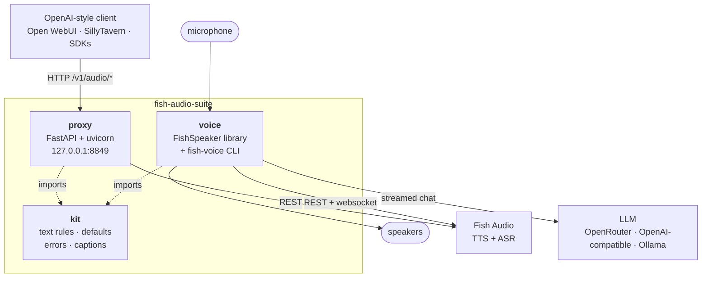
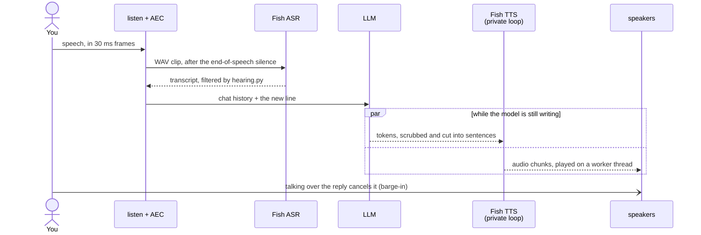

# Architecture

How fish-audio-suite is put together: the three packages, how data moves through them, and where to look when you change something. For setup and usage, see the [README](../README.md). For the rules contributors follow, see [AGENTS.md](../AGENTS.md) and the `AGENTS.md` in each package. For latency, see [PERFORMANCE.md](PERFORMANCE.md).

> [!NOTE]
> Update this file when a module is added, renamed or split, or when a boundary between packages moves.

## 1. Project structure

A uv workspace with three Python packages. The repository root is not a package.

```
fish-audio-suite/
├── packages/
│   ├── kit/                       # pure text and types, no I/O
│   │   ├── src/fish_audio_suite_kit/
│   │   └── tests/                 # incl. golden/kit_api.json (API snapshot)
│   ├── proxy/                     # OpenAI-compatible HTTP server
│   │   ├── src/fish_audio_suite_proxy/
│   │   └── tests/
│   └── voice/                     # live TTS library + fish-voice CLI
│       ├── src/fish_audio_suite_voice/
│       ├── tests/
│       └── dev.sh                 # runs fish-voice from the checkout
├── tests/                         # repo-wide: documented env defaults
├── docs/                          # install, integrations, architecture, …
├── nix/module.nix                 # NixOS module for the proxy service
├── flake.nix, flake.lock          # Nix packages, apps, checks
├── Dockerfile                     # proxy container image
├── .github/
│   ├── workflows/                 # ci, release, audit, dependency-submission
│   ├── actions/gates/             # the shared lint, type and test steps
│   └── scripts/verifytypes.py     # public API type-completeness floors
├── .agents/skills/                # agent skills: finalize, Fish API refs
├── pyproject.toml, uv.lock        # workspace and tool config
├── justfile                       # just check, just types-public, ...
├── .env.example                   # every setting, documented
├── AGENTS.md, CONTRIBUTING.md, SECURITY.md, README.md
```

Each package has `py.typed` and a curated `__init__.py`. The names in a package root's `__all__` are its public API; everything else is internal.

## 2. High-level system diagram

Two independent programs sit on one shared library. Neither program talks to the other.



### The voice turn

`fish-voice` runs one loop: listen, transcribe, answer, speak, repeat.



Module by module:

```
mic frames (30 ms, 16 kHz)
  │  listen.py: webrtcvad + loudness floor start and end the utterance;
  │  AEC3 removes the bot's own voice
  ▼
WAV clip ──► Fish ASR (REST)
  ▼
hearing.py: skip hallucinations, fillers and stale repeats; detect quit
  ▼
history.py: append the user line (trimmed to FISH_VOICE_HISTORY_TURNS)
  ▼
llm.py / transports.py: stream tokens from the chat model        ┐ run at the
  ▼                                                              │ same time,
reply.py: _TokenPipe hands tokens to the TTS thread              │ on two event
  ▼                                                              │ loops in two
stream_scrub.py (kit helpers): scrub markup, hold open spans,    │ threads
  cut sentences, normalize [cue] tags                            │
  ▼                                                              │
speaker.py / tts_turn.py / wire.py: one Fish websocket per turn, ┘
  on a private event loop; text events + flush ──► audio chunks
  ▼
playback.py: SounddeviceSink writes ~30 ms slices on a worker thread;
  each slice also feeds the AEC far-end reference
  ▼
barge.py: while audio plays, loud voiced mic frames cancel the turn
  ▼
spoken.py: history records only what was actually heard (spoken_so_far)
```

> [!TIP]
> Two threads matter. The LLM streams on the main asyncio loop. The Fish websocket runs on its own loop in a `fish-tts` thread, so a slow or cancelled Fish stream can never stall the LLM, and the SDK's anyio cancel scopes stay on the loop that created them. Microphone capture uses PortAudio callbacks, and the barge-in gate watches the mic on a thread of its own.

### The proxy request

```
POST /v1/audio/speech (OpenAI JSON)
  → body_limit.py: cap the body before any route reads it
  → server.py: client key check (FISH_PROXY_API_KEYS)
  → request_fields.py / speech.py: map OpenAI fields onto a Fish TTS body
    and scrub the text with the kit
  → junk text? return local silence (audio.py), never call Fish
  → upstream.py fish_send: shared httpx client, bounded retry with Retry-After
  → stream Fish's audio back to the client as it arrives

POST /v1/audio/transcriptions (multipart or JSON)
  → transcribe.py: parse the upload and options
  → Fish /v1/asr
  → kit scrub_asr, phrases.py: group word timings into caption cues
  → json | text | verbose_json | srt | vtt
```

## 3. Core components

There is no frontend. The user-facing parts are an HTTP API (the proxy) and a terminal program (`fish-voice`).

### 3.1. fish-audio-suite-kit

- **Description:** shared, pure functions and types. It holds every rule that both programs need, so it is written once: scrubbing markdown and thoughts out of TTS text, Fish `[cue]` tags, sentence cuts and stream holds for streaming TTS, ASR cleanup and hallucination checks, the Fish error shape and retry policy, settings defaults and env readers, caption formatting, and W3C trace headers.
- **Technologies:** Python 3.12+, standard library only (no runtime dependencies).
- **Deployment:** a wheel. Proxy and voice pin `fish-audio-suite-kit>=0.1,<0.2`; in the workspace the local source is used.
- **Key modules:** `scrub_tts`, `stream_holds`, `cuts`, `cues`, `dialogue`, `junk`, `asr_text`, `captions`, `http_errors`, `defaults`, `env`, `timing`, `trace_context`, `literals`, `payloads`. Private helpers: `_charsets`, `_single_pass`.

### 3.2. fish-audio-suite-proxy

- **Description:** an OpenAI Audio API in front of Fish Audio, so apps that speak OpenAI's TTS and speech-to-text APIs can use Fish voices without code changes. It maps model names (`tts-1`, `whisper-1`) onto Fish models, scrubs text, retries politely and streams audio back.
- **Technologies:** FastAPI, uvicorn (with uvloop and httptools), httpx, ormsgpack (reference-audio bodies), python-multipart.
- **Deployment:** `fish-audio-suite-proxy` on `127.0.0.1:8849` by default; the Docker image; or the NixOS module (`nixosModules.default`, a native systemd service or an OCI container).
- **Key modules:** `server` (app, lifespan, routes), `settings` (one validated settings object, read once), `upstream` (`fish_send` with retry), `speech`, `transcribe`, `phrases`, `audio`, `request_fields`, `models`, `errors`, `body_limit`.

### 3.3. fish-audio-suite-voice

- **Description:** two things in one package.
  - A **library**: `FishSpeaker.speak(text, sink)` and `speak_stream(tokens, sink)` run one Fish TTS websocket turn on a private thread and loop, and write audio to a `PlaybackSink` (speakers, a file, stdout or mpv).
  - **`fish-voice`**: a full-duplex voice chat built on the library, with mic, VAD, echo cancellation, Fish ASR, an LLM, streamed Fish TTS and barge-in.
- **Technologies:** fish-audio-sdk (websocket TTS), httpx (ASR, OpenAI-compatible SSE), the openrouter SDK, numpy, loguru. The `cli` extra adds sounddevice (PortAudio), webrtcvad-wheels and pywebrtc-audio (AEC3).
- **Deployment:** runs on the user's machine: `uv run --package fish-audio-suite-voice --extra cli fish-voice`, `./packages/voice/dev.sh`, or the flake app `fish-audio-suite-voice`.
- **Key modules by layer:**

| Layer | Modules |
| --- | --- |
| Settings | `config` (`VoiceCliConfig`), `tune` (listen, barge and AEC tunes, env readers), `llm_tune` (`LlmTune`, provider table) |
| Duplex loop | `duplex` (the loop), `duplex_state` (`DuplexContext`), `hearing` (listen and ASR), `reply` (answer and speak), `history`, `signals` (cancel and quit flags) |
| Audio in | `listen`, `barge`, `floor`, `aec` |
| Speech out | `speaker` (`FishSpeaker`), `tts_turn` (one turn with retry), `wire` (websocket pump, `TtsResult`), `stream_scrub`, `playback`, `spoken` |
| LLM | `llm` (`ChatBackend`, retry, stats), `transports` (OpenRouter SDK or httpx SSE) |
| Support | `asr`, `cancel`, `pause`, `debug`, `console`, `ws_tap`, `envfile`, `cli` |

## 4. Data stores

> [!IMPORTANT]
> There is no database and nothing is written to disk.

- **Chat history:** a list of messages in memory (`DuplexContext.history`). It is trimmed to `FISH_VOICE_HISTORY_TURNS` user and assistant pairs, keeps the system prompt (and the default prompt's opening example) pinned, and is lost when `fish-voice` exits.
- **Settings:** read from the environment and an optional `.env` file once at startup. The proxy keeps them in one object on `app.state.settings`.
- **Audio:** streamed through memory. A `FileSink` writes a file only when a library caller asks for one.

## 5. External integrations

| Service | Purpose | Method |
| --- | --- | --- |
| Fish Audio TTS | Speech for both programs | Proxy: REST `POST /v1/tts` (JSON, or msgpack with reference audio). Voice: the live websocket `/v1/tts/live` through `fish-audio-sdk` |
| Fish Audio ASR | Speech-to-text | REST `POST /v1/asr`, multipart. Models `transcribe-1` and `transcribe-1-pro` |
| OpenRouter | Default LLM for `fish-voice` | The `openrouter` SDK, streamed; sends `provider.sort` (latency by default) and attribution headers |
| Any OpenAI-compatible server | Alternative LLM (Experiential, a self-hosted server, Ollama) | httpx Server-Sent Events against `/chat/completions` |

Keys stay with their own host. Each named LLM provider reads only its own key variable, a known provider's key goes only to its own host, and the automatic key is sent only over https.

## 6. Deployment and infrastructure

- **Hosting:** self-hosted only, with no cloud provider required. The proxy runs wherever Python, Docker or NixOS runs. `fish-voice` runs on a desktop with a microphone and speakers.
- **Packaging:** wheels built with `uv build --all` (hatchling); a Docker image (`python:3.12-slim-bookworm`, non-root user, `/health` healthcheck); and Nix packages, apps and a NixOS module from `flake.nix`.
- **Releases:** none until 1.0.0. Versions stay at 0.1.0 and nothing is published to PyPI. `release.yml` publishes on a `v*` tag only when the repository variable `PYPI_PUBLISH` is `true`.
- **CI/CD:** GitHub Actions.
  - `ci.yml` runs the shared gates on Python 3.12, 3.13 and 3.14: ruff, pydoclint, basedpyright, type-completeness floors, and pytest with coverage floors.
  - It also tests the lowest supported dependency versions, lints the workflows with zizmor, builds the wheels (`twine check`), runs `nix flake check`, and builds the Docker image and checks `/health`.
  - Separately, CodeQL scans the code, `audit.yml` runs pip-audit, `dependency-submission.yml` feeds GitHub's dependency graph, and Dependabot updates actions, uv, Docker and Nix with a 7-day cooldown.
- **Monitoring and logging:**
  - The proxy logs through Python logging (uvicorn access log plus two lines per speech request) and exposes `GET /health`. Request text is logged only with `FISH_PROXY_LOG_TEXT`.
  - `fish-voice` logs through loguru: `--debug` for events and `--trace` for mic heartbeats, websocket events and HTTP lines.
  - Each turn has one W3C trace id. It goes to Fish ASR and Fish TTS in the `traceparent` header, and to OpenRouter in the request's `trace` field, so a turn can be followed across services.

## 7. Security considerations

> [!CAUTION]
> The proxy spends your Fish credits for any client that can reach it. Without `FISH_PROXY_API_KEYS`, keep it on loopback.

- **Authentication:**
  - The proxy has optional client keys (`FISH_PROXY_API_KEYS`, sent as a Bearer token). A set but empty value refuses to start, rather than silently turning authentication off.
  - Without keys it accepts any client, so it binds to loopback by default.
  - It sends upstream with the operator's `FISH_API_KEY`, which is read in the lifespan, never at import.
- **Authorization:** none beyond the client key; every valid key has full access.
- **Data in transit:** https to Fish and to LLM providers. A plain `http` base on a non-loopback host only warns, because self-hosting on a LAN is legitimate.
- **Secrets:** key fields use `repr=False` and are never logged or shown in `/health`. Debug metadata strips `Authorization`, cookies and message bodies.
- **Hostile input:**
  - Request bodies and text length are capped.
  - Multipart forms are always closed.
  - Text helpers run in linear time on adversarial input, with regression tests that time them.
  - Deeply nested JSON is a 400, not a crash.
  - A transport error never reaches a client; it gets a fixed 502 or 504 message.
- **Supply chain:** pinned lockfile, pip-audit, CodeQL, zizmor, CycloneDX SBOM on release. See [SECURITY.md](../SECURITY.md) for reporting.

## 8. Development and testing

- **Setup:** `uv sync --all-packages --extra cli --group dev --group test`. Details in [CONTRIBUTING.md](../CONTRIBUTING.md).
- **All gates:** `just check` runs lint, docstrings, types and tests with the CI coverage floors.
- **Testing:**
  - pytest with random ordering, warnings as errors, and the network blocked (`--disable-socket`; Unix sockets are allowed for asyncio).
  - Hypothesis property tests for streaming and spoken-prefix logic.
  - Doctests run in kit docstrings.
  - Timing guards are marked `perf` and can be skipped with `-m 'not perf'`.
  - Coverage floors: 89% total, with kit 94, proxy 94 and voice 85.
- **Code quality:**
  - ruff (lint and format, including docstring rules).
  - pydoclint for NumPy-style docstrings.
  - basedpyright in strict mode, plus `verifytypes.py`, which keeps public API type completeness at 100%.
  - The golden file `packages/kit/tests/golden/kit_api.json` makes every kit API change visible in review.
- **Without hardware:** tests fake the microphone, speakers, Fish and the LLM. `fish-voice --smoke` synthesizes one line with Fish into a WAV file, which checks the key, voice and network without a microphone or speakers.

## 9. Future considerations

Known architectural debt and likely changes, roughly in order of value:

- **A mic that stays open.** The mic closes during each reply and reopens afterwards, so speech in the post-reply cooldown, and about 50 to 300 ms after a barge-in, is lost. A persistent capture stream that is gated, not closed, would fix both.
- **Turn detection beyond silence.** A small end-of-turn model (for example Pipecat's Smart Turn) would allow a shorter end-of-speech wait without cutting off pauses.
- **Trimming trailing silence** from ASR clips.
- **Linear held spans** in the stream scrubber, by remembering where a span opened across tokens.
- **Memory across sessions**, which would mean the project's first persistent store.
- **1.0.0:** PyPI trusted publishing, a container registry image, and the deprecation policy taking effect.
- **Reusing one Fish websocket across turns** is possible in Fish's protocol, but it is deliberately not done: its setup cost is already hidden behind the LLM.

## 10. Project identification

- **Project:** fish-audio-suite (unofficial; not affiliated with Fish Audio)
- **Repository:** https://github.com/kzndotsh/fish-audio-suite
- **Maintainer:** kzndotsh
- **License:** MIT ([LICENSE](../LICENSE))
- **Last updated:** 2026-10-04

## 11. Glossary

| Term | Meaning |
| --- | --- |
| **AEC / AEC3** | Acoustic echo cancellation. WebRTC's AEC3 removes the bot's own voice from the microphone signal, using what was sent to the speakers as the reference ("far end") |
| **ASR** | Automatic speech recognition: Fish's speech-to-text |
| **Backchannel** | A listener noise such as "mm-hmm" or "yeah". Over a reply it means "go on" and is ignored; on its own turn "yeah" is an answer |
| **Barge-in** | Talking over the bot. Enough loud voiced frames in a row cancel the reply and start a new listen |
| **Bleed delay** | Time after playback starts before barge-in listens, so the speaker's own sound is not taken for a user |
| **Cue** | A bracketed stage direction for Fish TTS, such as `[happy]` or `[laughing]`. Never spoken as words |
| **Cooldown** | Seconds the mic stays shut after a reply ends |
| **Duplex** | The two-way loop in `fish-voice`: listen and speak, with interruption |
| **Early flush** | A `FlushEvent` sent after the first sentence of a streamed reply, so Fish starts speaking before the model finishes |
| **Flush** | Tells Fish to synthesize the text it holds. Fish waits for a flush (or a full chunk) before speaking |
| **Held span** | Streamed text kept back because it is unfinished: an open `**`, `<think>`, `(` or URL that a scrub rule would remove once closed |
| **Kit** | `fish-audio-suite-kit`, the shared library |
| **Lead cue** | A cue at the start of a reply or sentence that sets its mood |
| **Private loop** | The separate asyncio event loop and thread a Fish websocket turn runs on |
| **Sink** | Where audio goes: `SounddeviceSink` (speakers), `FileSink`, `StdoutSink`, `MpvSink` |
| **Spoken so far** | The part of a reply that was actually heard, estimated from bytes played. Only this goes into history after a barge-in |
| **TTFA / first token** | Time to first audio from Fish; time to the first token from the LLM |
| **Turn** | One user line and the bot's reply |
| **VAD** | Voice activity detection: webrtcvad decides whether a 30 ms frame contains speech |
