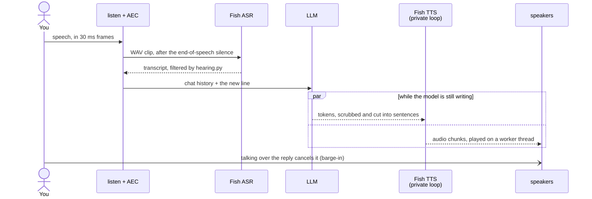
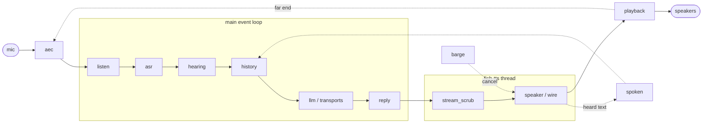

# Architecture

How fish-audio-suite is put together: the three packages, how data moves through them, and where to look when you change something. For setup and usage, see the [README](../README.md). For the rules contributors follow, see [CONTRIBUTING.md](../CONTRIBUTING.md) and the [invariants](#9-invariants) below. For latency, see [PERFORMANCE.md](PERFORMANCE.md).

> [!NOTE]
> Update this file when a module is added, renamed or split, or when a boundary between packages moves.

## 1. Project structure

A uv workspace with three Python packages. The repository root is not a package.

```
fish-audio-suite/
├── packages/
│   ├── kit/                       # pure text and types, no I/O
│   │   ├── src/fish_audio_suite_kit/
│   │   └── tests/                 # incl. golden/kit_api.json (API snapshot)
│   ├── proxy/                     # OpenAI-compatible HTTP server
│   │   ├── src/fish_audio_suite_proxy/
│   │   └── tests/
│   └── voice/                     # live TTS library + fish-voice CLI
│       ├── src/fish_audio_suite_voice/
│       ├── tests/
│       └── dev.sh                 # runs fish-voice from the checkout
├── tests/                         # repo-wide: documented env defaults
├── docs/                          # INDEX.md lists them all
├── nix/module.nix                 # NixOS module for the proxy service
├── flake.nix, flake.lock          # Nix packages, apps, checks
├── Dockerfile                     # proxy container image
├── .github/
│   ├── workflows/                 # ci, release, audit, dependency-submission
│   ├── actions/gates/             # the shared lint, type and test steps
│   └── scripts/verifytypes.py     # public API type-completeness floors
├── .agents/skills/                # agent skills: finalize, Fish API refs
├── pyproject.toml, uv.lock        # workspace and tool config
├── justfile                       # just check, just types-public, ...
├── .env.example                   # every setting, documented
├── AGENTS.md, CONTRIBUTING.md, SECURITY.md, README.md
```

Each package has `py.typed` and a curated `__init__.py`. The names in a package root's `__all__` are its public API; everything else is internal.

## 2. High-level system diagram

Two independent programs sit on one shared library. Neither program talks to the other.


### The voice turn

`fish-voice` runs one loop: listen, transcribe, answer, speak, repeat.



Module by module:



| Module | Job |
| --- | --- |
| `aec` | AEC3 removes the bot's own voice from the mic, using what `playback` sends as the reference |
| `listen` | webrtcvad and a loudness floor start and end the utterance |
| `asr` | Sends the WAV clip to Fish ASR |
| `hearing` | Skips hallucinations, fillers and stale repeats; detects quit |
| `history` | Appends the user line and trims to `FISH_VOICE_HISTORY_TURNS` |
| `llm` / `transports` | Streams tokens from the chat model |
| `reply` | `_TokenPipe` hands tokens to the TTS thread |
| `stream_scrub` | Kit helpers scrub markup, hold open spans, cut sentences, normalize cues |
| `speaker` / `tts_turn` / `wire` | One Fish websocket per turn: text and flush out, audio chunks back |
| `playback` | Writes ~30 ms slices to the speakers on a worker thread |
| `barge` | Watches the mic on its own thread while audio plays; loud voiced frames cancel the turn |
| `spoken` | Records only what was heard (`spoken_so_far`) for history |

> [!TIP]
> Two threads matter. The LLM streams on the main asyncio loop. The Fish websocket runs on its own loop in a `fish-tts` thread, so a slow or cancelled Fish stream can never stall the LLM, and the SDK's anyio cancel scopes stay on the loop that created them. Microphone capture uses PortAudio callbacks, and the barge-in gate watches the mic on a thread of its own.

### The proxy request

```
POST /v1/audio/speech (OpenAI JSON)
  → body_limit.py: cap the body before any route reads it
  → server.py: client key check (FISH_PROXY_API_KEYS)
  → request_fields.py / speech.py: map OpenAI fields onto a Fish TTS body
    and scrub the text with the kit
  → junk text? return local silence (audio.py), never call Fish
  → upstream.py fish_send: shared httpx client, bounded retry with Retry-After
  → stream Fish's audio back to the client as it arrives

POST /v1/audio/transcriptions (multipart or JSON)
  → transcribe.py: parse the upload and options
  → Fish /v1/asr
  → kit scrub_asr, phrases.py: group word timings into caption cues
  → json | text | verbose_json | srt | vtt
```

## 3. Core components

There is no frontend. The user-facing parts are an HTTP API (the proxy) and a terminal program (`fish-voice`).

### 3.1. fish-audio-suite-kit

- **Description:** shared, pure functions and types. It holds every rule that both programs need, so it is written once: scrubbing markdown and thoughts out of TTS text, Fish `[cue]` tags, sentence cuts and stream holds for streaming TTS, ASR cleanup and hallucination checks, the Fish error shape and retry policy, settings defaults and env readers, caption formatting, and W3C trace headers.
- **Technologies:** Python 3.12+, standard library only (no runtime dependencies).
- **Deployment:** a wheel. Proxy and voice pin `fish-audio-suite-kit>=0.1,<0.2`; in the workspace the local source is used.
- **Key modules:** `scrub_tts`, `stream_holds`, `cuts`, `cues`, `dialogue`, `junk`, `asr_text`, `captions`, `http_errors`, `defaults`, `env`, `timing`, `trace_context`, `literals`, `payloads`. Private helpers: `_charsets`, `_single_pass`.

### 3.2. fish-audio-suite-proxy

- **Description:** an OpenAI Audio API in front of Fish Audio, so apps that speak OpenAI's TTS and speech-to-text APIs can use Fish voices without code changes. It maps model names (`tts-1`, `whisper-1`) onto Fish models, scrubs text, retries politely and streams audio back.
- **Technologies:** FastAPI, uvicorn (with uvloop and httptools), httpx, ormsgpack (reference-audio bodies), python-multipart.
- **Deployment:** `fish-audio-suite-proxy` on `127.0.0.1:8849` by default; the Docker image; or the NixOS module (`nixosModules.default`, a native systemd service or an OCI container).
- **Key modules:** `server` (app, lifespan, routes), `settings` (one validated settings object, read once), `upstream` (`fish_send` with retry), `speech`, `transcribe`, `phrases`, `audio`, `request_fields`, `models`, `errors`, `body_limit`.

### 3.3. fish-audio-suite-voice

- **Description:** two things in one package.
  - A **library**: `FishSpeaker.speak(text, sink)` and `speak_stream(tokens, sink)` run one Fish TTS websocket turn on a private thread and loop, and write audio to a `PlaybackSink` (speakers, a file, stdout or mpv).
  - **`fish-voice`**: a full-duplex voice chat built on the library, with mic, VAD, echo cancellation, Fish ASR, an LLM, streamed Fish TTS and barge-in.
- **Technologies:** fish-audio-sdk (websocket TTS), httpx (ASR, OpenAI-compatible SSE), the openrouter SDK, numpy, loguru. The `cli` extra adds sounddevice (PortAudio), webrtcvad-wheels and pywebrtc-audio (AEC3).
- **Deployment:** runs on the user's machine: `uv run --package fish-audio-suite-voice --extra cli fish-voice`, `./packages/voice/dev.sh`, or the flake app `fish-audio-suite-voice`.
- **Key modules by layer:**

| Layer | Modules |
| --- | --- |
| Settings | `config` (`VoiceCliConfig`), `tune` (listen, barge and AEC tunes, env readers), `llm_tune` (`LlmTune`, provider table) |
| Duplex loop | `duplex` (the loop), `duplex_state` (`DuplexContext`), `hearing` (listen and ASR), `reply` (answer and speak), `history`, `signals` (cancel and quit flags) |
| Audio in | `listen`, `barge`, `floor`, `aec` |
| Speech out | `speaker` (`FishSpeaker`), `tts_turn` (one turn with retry), `wire` (websocket pump, `TtsResult`), `declick` (fades the start and end of each sentence that meets silence), `stream_scrub`, `playback`, `spoken` |
| LLM | `llm` (`ChatBackend`, retry, stats), `transports` (OpenRouter SDK or httpx SSE) |
| Events | `events` (`EVENTS`, the typed events a display follows, `StateTracker`, `EventQueue`, `forward_logs`), `console_sink` (the plain terminal display, one subscriber), `inputs` (`TurnSource`, and `LiveInput` for typed lines and mute), `session_view` (`reduce_view` folds events into one immutable `SessionView`), `tui` (the Textual app, `fish-voice --tui`, needs the `tui` extra) |
| Support | `asr`, `cancel`, `pause`, `debug`, `console`, `ws_tap`, `envfile`, `cli` |

## 4. Data stores

> [!IMPORTANT]
> There is no database and nothing is written to disk.

- **Chat history:** a list of messages in memory (`DuplexContext.history`). It is trimmed to `FISH_VOICE_HISTORY_TURNS` user and assistant pairs, keeps the system prompt (and the default prompt's opening example) pinned, and is lost when `fish-voice` exits.
- **Settings:** read from the environment and an optional `.env` file once at startup. The proxy keeps them in one object on `app.state.settings`.
- **Audio:** streamed through memory. A `FileSink` writes a file only when a library caller asks for one.

## 5. External integrations

| Service | Purpose | Method |
| --- | --- | --- |
| Fish Audio TTS | Speech for both programs | Proxy: REST `POST /v1/tts` (JSON, or msgpack with reference audio). Voice: the live websocket `/v1/tts/live` through `fish-audio-sdk` |
| Fish Audio ASR | Speech-to-text | REST `POST /v1/asr`, multipart. Models `transcribe-1` and `transcribe-1-pro` |
| OpenRouter | Default LLM for `fish-voice` | The `openrouter` SDK, streamed; sends `provider.sort` (latency by default) and attribution headers |
| Any OpenAI-compatible server | Alternative LLM (Experiential, a self-hosted server, Ollama) | httpx Server-Sent Events against `/chat/completions` |

Keys stay with their own host. Each named LLM provider reads only its own key variable, a known provider's key goes only to its own host, and the automatic key is sent only over https.

## 6. Deployment and infrastructure

- **Hosting:** self-hosted only, with no cloud provider required. The proxy runs wherever Python, Docker or NixOS runs. `fish-voice` runs on a desktop with a microphone and speakers.
- **Packaging:** wheels built with `uv build --all` (hatchling); a Docker image (`python:3.12-slim-bookworm`, non-root user, `/health` healthcheck); and Nix packages, apps and a NixOS module from `flake.nix`.
- **Releases:** none until 1.0.0. Versions stay at 0.1.0 and nothing is published to PyPI. `release.yml` publishes on a `v*` tag only when the repository variable `PYPI_PUBLISH` is `true`.
- **CI/CD:** GitHub Actions.
  - `ci.yml` runs the shared gates on Python 3.12, 3.13 and 3.14: ruff, pydoclint, basedpyright, type-completeness floors, and pytest with coverage floors.
  - It also tests the lowest supported dependency versions, lints the workflows with zizmor, builds the wheels (`twine check`), runs `nix flake check`, and builds the Docker image and checks `/health`.
  - Separately, CodeQL scans the code. `audit.yml` runs pip-audit on the exported lock for pull requests that touch it, and weekly. `dependency-submission.yml` feeds GitHub's dependency graph on a push to `main` when `uv.lock` changes. Dependabot updates actions, uv, Docker and Nix with a 7-day cooldown.
- **Monitoring and logging:**
  - The proxy logs through Python logging (uvicorn access log plus two lines per speech request) and exposes `GET /health`. Request text is logged only with `FISH_PROXY_LOG_TEXT`.
  - `fish-voice` logs through loguru: `--debug` for events and `--trace` for mic heartbeats, websocket events and HTTP lines.
  - Each turn has one W3C trace id. It goes to Fish ASR and Fish TTS in the `traceparent` header, and to OpenRouter in the request's `trace` field, so a turn can be followed across services.

## 7. Security considerations

> [!CAUTION]
> The proxy spends your Fish credits for any client that can reach it. Without `FISH_PROXY_API_KEYS`, keep it on loopback.

- **Authentication:**
  - The proxy has optional client keys (`FISH_PROXY_API_KEYS`, sent as a Bearer token). A set but empty value refuses to start, rather than silently turning authentication off.
  - Without keys it accepts any client, so it binds to loopback by default.
  - It sends upstream with the operator's `FISH_API_KEY`, which is read in the lifespan, never at import.
- **Authorization:** none beyond the client key; every valid key has full access.
- **Data in transit:** https to Fish and to LLM providers. A plain `http` base on a non-loopback host only warns, because self-hosting on a LAN is legitimate.
- **Secrets:** key fields use `repr=False` and are never logged or shown in `/health`. Debug metadata strips `Authorization`, cookies and message bodies.
- **Hostile input:**
  - Request bodies and text length are capped.
  - Multipart forms are always closed.
  - Text helpers run in linear time on adversarial input, with regression tests that time them.
  - Deeply nested JSON is a 400, not a crash.
  - A transport error never reaches a client; it gets a fixed 502 or 504 message.
- **Supply chain:** pinned lockfile, pip-audit, CodeQL, zizmor, CycloneDX SBOM on release. See [SECURITY.md](../SECURITY.md) for reporting.

## 8. Development and testing

- **Setup:** `uv sync --all-packages --extra cli --group dev --group test`. Details in [CONTRIBUTING.md](../CONTRIBUTING.md).
- **All gates:** `just check` runs lint, docstrings, types and tests with the CI coverage floors.
- **Testing:**
  - pytest with random ordering, warnings as errors, and the network blocked (`--disable-socket`; Unix sockets are allowed for asyncio).
  - Hypothesis property tests for streaming and spoken-prefix logic.
  - Doctests run in kit docstrings.
  - Timing guards are marked `perf` and can be skipped with `-m 'not perf'`.
  - Coverage floors: 89% total, with kit 94, proxy 94 and voice 85.
- **Code quality:**
  - ruff (lint and format, including docstring rules).
  - pydoclint for NumPy-style docstrings.
  - basedpyright in strict mode, plus `verifytypes.py`, which keeps public API type completeness at 100%.
  - The golden file `packages/kit/tests/golden/kit_api.json` makes every kit API change visible in review.
- **Without hardware:** tests fake the microphone, speakers, Fish and the LLM. `fish-voice --smoke` synthesizes one line with Fish into a WAV file, which checks the key, voice and network without a microphone or speakers.

## 9. Invariants

The rules most easily broken, each with its reason. A test or a lint rule enforces a rule where one exists, and the rest depend on review.

### Package boundaries

- **Three distributions only: `fish-audio-suite-kit`, `-proxy` and `-voice`.** The CLI stays in voice. There is no fourth package, no OpenTelemetry SDK (kit parses W3C trace headers itself) and no VAD package of our own (voice uses `webrtcvad-wheels`).
- **Shared logic lives in kit.** Scrubbing, cues, sentence cuts, W3C parsing, the Fish error shape and captions are written once there. Proxy and voice must not copy those regexes, and they import kit only through its root, never a private module.
- **Kit is pure text.** No network, no audio, no HTTP client, no `fishaudio`, no OpenTelemetry. `dependencies = []` keeps that honest, and a test checks that its sources import only the standard library.

### Speaking

- **One Fish websocket per turn, on a private event loop in its own thread** (`FishSpeaker.speak`, `speak_stream`). The Fish SDK holds an anyio cancel scope inside its stream, so touching the stream from any other task raises "cancel scope in a different task". The LLM's loop must never wait on the websocket either. The pump therefore reads the SDK iterator from a single task.
- **Never `aclose()` the websocket iterator.** Stop iterating and close the client instead. Closing the iterator from another task raises the same cancel-scope error.
- **Flush after sent text, never per sentence.** An empty turn followed by a bare flush is invalid. Fish holds text until a flush or a full chunk, so one flush at the end would keep a streamed reply silent until the model finished. A streamed reply therefore flushes once at the end of the first sentence (judged on all text sent so far, so "Mr" then "." is not one) and once at the end. A flush mid-sentence makes Fish close the fragment as a finished utterance and pause.
- **History records only what was heard** (`spoken_so_far`), or nothing when no audio played. Storing the full reply would teach the next turn about words the user never heard.
- **Playback never blocks the TTS loop.** Each chunk is written on a worker thread, and cancel and tokens wake the loop instead of being polled. A blocked loop stalls text going to Fish and audio coming back.
- **`CancelledError` ends a stream quietly only when `is_own_cancel(flag)` is true.** Anything else (`asyncio.timeout`, an outer `task.cancel()`) must propagate. Reap a cancelled child with `reap(task)`, never `suppress(BaseException)`, so Ctrl+C and `SystemExit` are not swallowed. Ctrl+C must cancel the TTS turn (`session.turn`), not only the mic.

### Events

- **The loop reports; displays follow.** Each step of a session is an event on `events.EVENTS`, and the plain terminal output is one subscriber (`console_sink.ConsoleSink`), so a screen of its own sees the same facts the console prints. New output goes through an event, not a direct print, or a full-screen display would miss it or be corrupted by it. A test (`test_repo_rules`) fails when session code calls `print` or touches `sys.stdout` or `sys.stderr`; only the plain display, `cli` startup and the raw stdout audio sink may.
- **A subscriber runs on the thread that emitted the event**, which can be the event loop or an audio thread. It has to return quickly. A consumer that works at its own pace uses `EventQueue`, which drops only mic levels and log lines when it falls behind. A subscriber that raises is reported and cannot stop the session. Every event is a frozen, timestamped dataclass, exported from `events`, so it is safe to hand to another thread or wrap in a UI message; a test checks that for each event type, including new ones.

### Text rules

- **Roleplay helpers are opt-in.** `normalize_cues(lead=True)`, `tts_hold_at(lead=True)` and `is_tts_junk(drop_narration=True)` rewrite or drop ordinary-looking English, so nothing in the default path may match it.
- **Gates drop only noise.** The letter floor is `min_letters=2` with a `short_words` allowlist ("no", "ok"), and the quit and backchannel lists take caller phrases and default to explicit goodbyes and listener noise only.
- **The default system prompt is voice formatting and cue use only.** No persona, scene or refusal wording: a character belongs in a character file.
- **A regex over model text is bounded or anchored.** An unbounded scan from every opener is quadratic, and this text is untrusted. Timing tests run hostile 20,000-character inputs through the scrubbers and extractors.
- **`Retry-After` is parsed in one place** (`retry_after_s`). Other packages must not write their own.

### Settings and secrets

- **Env vars are read at startup, never at import.** `FISH_API_KEY` is read in the proxy's lifespan, the CLI, or `FishSpeaker(...)`, so importing the app and `GET /health` work with no key. There is no default voice id.
- **Voice reads settings only in `config.load_config()` and the `*.from_env()` tunes**, once, with validation (a bad value warns and uses the default). Library classes take their settings as arguments. Two exceptions are not settings: `debug.debug_level()` reads `FISH_VOICE_DEBUG`, and `envfile` writes `os.environ` when it loads a dotenv file.
- **Key fields use `repr=False`.** Keys never reach a log or `/health`. A key goes only to its own host: each LLM provider reads only its own key variable, and the host of the final base URL decides which provider that is.

### The proxy

- **An error from the transport never reaches a client.** The client gets a fixed 502 or 504 message, and the detail goes to the log.
- **Close every multipart form** (`async with request.form()`).
- **An unset or empty `FISH_PROXY_API_KEYS` must not silently mean "no auth" after a typo.** Set but empty refuses to start.

## 10. Future considerations

Known architectural debt and likely changes, roughly in order of value:

- **A full-screen terminal app.** Everything it needs to follow a session is on the event bus (`events.EVENTS`): the conversation, state changes, the mic level, barge-in, log lines (`forward_logs`, with `configure_voice_logging(to_stderr=False)`), and timings. `duplex_turns(console=False, source=LiveInput())` lets it draw its own screen and take typed lines and mute. A Textual app would sit behind an optional extra in the voice package, and has to hand each event to its own thread (`EventQueue`) because a subscriber runs on the thread that emitted it. Its keys need care: a printable key goes to the focused input line, so mute and interrupt should be priority bindings, and Ctrl+I and Ctrl+M cannot be used because a terminal sends them as Tab and Enter. Quit has to call `session.request_quit`, not only close the screen. `events.DEFAULT_KEYS` holds the default key for each action (Enter, Escape, F2 to mute, Ctrl+Q to quit), and a test keeps them to keys terminals reliably pass on; Ctrl+C is left alone because a UI uses it to copy. The app needs a modern terminal: macOS's Terminal.app is limited to 256 colors and misaligns box characters, so it should fall back to plain `fish-voice` when it cannot draw the screen. Reply and transcript text is full of square brackets (`[calm]`), which a markup parser reads as tags, so show it as plain content (`Content(text)` or `markup=False`, never an f-string inside markup) and style cues with the kit's `split_cues`. Draw the mic meter from `SessionView.mic_fraction`, which is on a decibel scale, and let the UI ease between values (Textual's `animate`) on its own thread. Do not animate the reply text: it should appear as tokens arrive. Run `duplex_turns` as an async Textual worker: a cancelled worker (the app exiting) and a crash both still send `Bye` first, and a worker error exits the app unless `exit_on_error=False`. Packaging needs nothing new: the voice wheel is built by Hatchling, which includes a stylesheet (`.tcss`) kept inside `src/fish_audio_suite_voice/`, and the app would be a flag or extra on the existing `fish-voice` command, not a fourth distribution. When the stylesheet exists, add it to the wheel-content check. The `EventQueue` `wake` callback runs on the emitting thread, so it may only call thread-safe things such as `post_message`; everything else touches widgets from the app's own thread. `events.available_actions(state, muted=...)` says which actions apply now (interrupt only while thinking or speaking, mute or unmute, never both), for Textual's `check_action`, and `LiveInput.stop_reply` is the interrupt. Its state should be one `SessionView` assigned to a single reactive attribute: `reduce_view` returns a new value instead of mutating, which is what a Textual reactive can detect, and an equal value does not refresh. While building it, `textual run --dev` reloads its CSS on save and `textual console` shows its prints and logs, which stdout cannot while the app owns the terminal.
- **A mic that stays open.** The mic closes during each reply and reopens afterwards, so speech in the post-reply cooldown, and about 50 to 300 ms after a barge-in, is lost. A persistent capture stream that is gated, not closed, would fix both.
- **Turn detection beyond silence.** A small end-of-turn model (for example Pipecat's Smart Turn) would allow a shorter end-of-speech wait without cutting off pauses.
- **Trimming trailing silence** from ASR clips.
- **Linear held spans** in the stream scrubber, by remembering where a span opened across tokens.
- **Memory across sessions**, which would mean the project's first persistent store.
- **1.0.0:** PyPI trusted publishing, a container registry image, and the deprecation policy taking effect.
- **A real `stream_delay_ms` for AEC3.** The echo canceller is not told the real stream latency; the reference ring is trimmed instead. It is unverified on hardware.
- **Reusing one Fish websocket across turns** is possible in Fish's protocol, but it is deliberately not done: its setup cost is already hidden behind the LLM.

## 11. Project identification

- **Project:** fish-audio-suite (unofficial; not affiliated with Fish Audio)
- **Repository:** https://github.com/kzndotsh/fish-audio-suite
- **Maintainer:** kzndotsh
- **License:** MIT ([LICENSE](../LICENSE))
- **Last updated:** 2026-10-04

## 12. Glossary

The project's terms are defined in [GLOSSARY.md](GLOSSARY.md).
